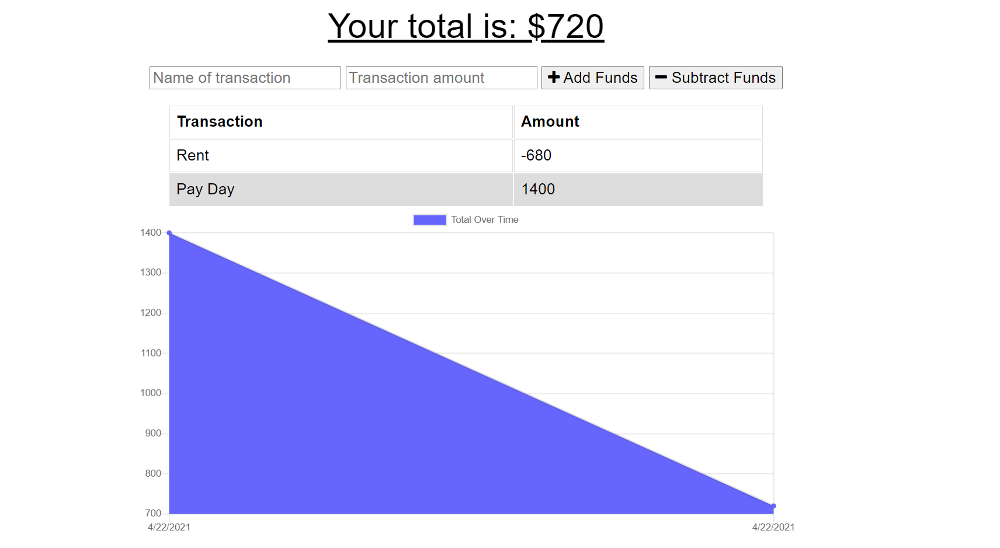

# Budget-Tracker

## Description

The app allows us to keep track of our income and expenses.

## Technologies Used

HTML, CSS, JavaScript, Node, Express, Mongoose, MongoDB, indexedDB, cache API, Service Workers

## Screenshots

## Links

### Heroku

https://budget-tracker-11.herokuapp.com/

### Github Repo

https://github.com/Bryan-Thaoxaochay/Budget-Tracker

## What I Learned

### List
1. Progressive Web Apps

Using webpack, I was able to give the app the ability to work offline. Along with that, cache API and service workers came in handy as well.

2. Minification

Using the JSCompress website, I was able to decrease some JS files into the minimum amount of code required.

3. IndexedDB

I was able to create an indexedDB database that would store API requests when the app was offline. Then, the data would be sent to a MongoDB database once back online.

## Contact Information

Email: bthaoxaochay@gmail.com
GitHub: https://github.com/Bryan-Thaoxaochay 